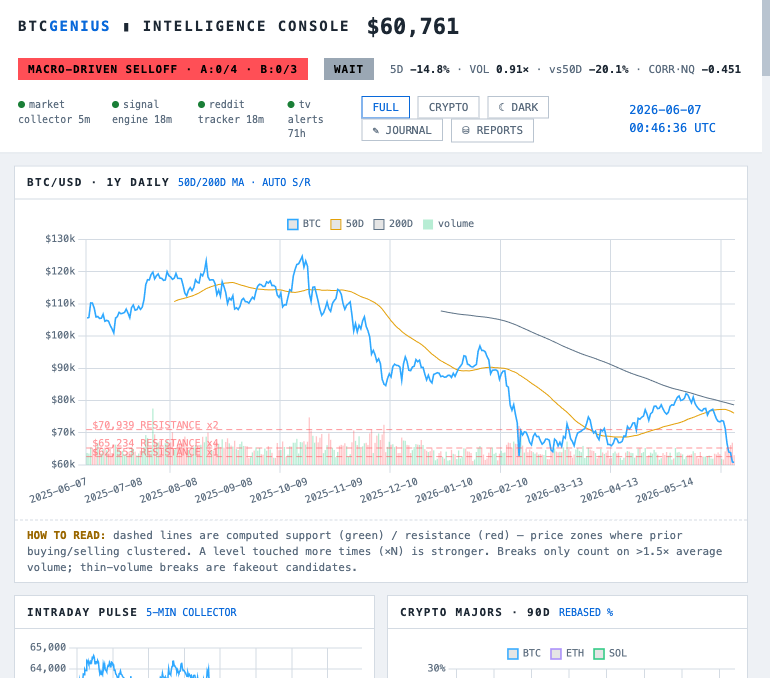

# BTC Genius — Intelligence Console

A self-hosted, real-time Bitcoin intelligence system that answers four questions:
**Why is BTC moving? When will the move stop? Should I buy, hold, or sell? Was that call right?**

Everything runs locally on macOS via launchd. Free data sources only. Stdlib
Python only — nothing to install. Every model call is logged and **graded
against price at its horizon**, so the system keeps an honest win/loss record
of itself (and of you).



## Quick start

```bash
launchctl list | grep btcgenius   # the 4 agents (collector, engine, reddit, listener)
open http://localhost:8787        # the console
cat data/dashboard.md             # same intelligence, plain markdown
```

## Architecture

```
                      ┌──────────────────────────────────────────────────────┐
  COLLECT             │  ENRICH & DECIDE          │  SERVE                   │
                      │                           │                          │
 market_collector.py ─┤ signal_engine.py (hourly) │ webhook_listener.py      │
  every 5 min         │  · regime classifier      │  (always-on, :8787)      │
  · BTC (Coinbase→    │  · A-score (macro release)│  · / dashboard           │
    Binance→Gecko)    │  · B-score (exhaustion)   │  · /reports analyst desk │
  · oil 10Y DXY NQ Au │  · X-score (froth)        │  · /journal /ledger      │
  · whale tape ≥$250k │  · support/resistance     │    /social               │
  · on-chain ≥$1M     │  · composite BUY/SELL/    │  · /feed/news /feed/x    │
                      │    HOLD verdict           │    (RSS + X w/ Bluesky   │
 reddit_tracker.py ───┤  · auto-graded journal    │     fallback)            │
  every 20 min        │                           │  · TradingView webhooks  │
  · OAuth sentiment   │ report_generator.py       │                          │
                      │  · daily analyst skeleton │  All UIs in web/, served │
 TradingView ─────────┤  · charts frozen per-day  │  same-origin, no CORS    │
  btc_genius.pine     │    into reports/assets/   │                          │
                      └──────────────────────────────────────────────────────┘

 STORAGE: JSONL streams (append-only, human-greppable) dual-written to
          SQLite (data/genius.db + data/feed.db) for queryable history.
```

## Project structure

```
├── src/                    # all Python (stdlib-only, Python 3.9+)
│   ├── market_collector.py #  5-min market pulse + whale ledger
│   ├── signal_engine.py    #  hourly framework computation + verdict model
│   ├── webhook_listener.py #  HTTP server: UIs, feeds, webhooks, archives
│   ├── reddit_tracker.py   #  sentiment buckets (OAuth w/ public fallback)
│   ├── report_generator.py #  daily analyst-report skeleton
│   ├── db.py               #  unified SQLite store (backfill + ad-hoc SQL)
│   ├── env_loader.py       #  tiny .env reader (env vars win)
│   └── model_lab.py        #  model experimentation sandbox
├── web/                    # dashboard, reports, journal, ledger, social UIs
├── docs/                   # SIGNALS.md (the strategy constitution),
│   └── img/                # INDICATORS.md (the economic chain), screenshots
├── tradingview/            # btc_genius.pine chart indicator
├── launchd/                # plists (source of truth; installed copies in
│                           #  ~/Library/LaunchAgents)
├── apps/btc-genius-devvit/ # Reddit Devvit app (independent sub-project/repo)
├── data/                   # runtime data (gitignored): JSONL + SQLite + reports
└── logs/                   # per-component logs (gitignored)
```

## The decision framework

Read **[docs/SIGNALS.md](docs/SIGNALS.md)** first — everything below implements it.

- **Regime** — macro-driven selloff / crypto-specific selloff / basing / trending / froth,
  classified from price action + the macro chain (oil → yields → DXY → equities → gold → BTC,
  documented in [docs/INDICATORS.md](docs/INDICATORS.md))
- **A-score** — is the *cause* of the selloff releasing? (oil rolls over, yields peak,
  DXY tops, equities stabilize)
- **B-score** — are *sellers* exhausted? (capitulation volume, correlation re-couples,
  failed new low)
- **Verdict** — a weighted composite (valuation / trend / macro / exhaustion / froth /
  volume, each voting -2…+2) maps to **BUY / SELL / HOLD / WAIT** with a built-in
  doctrine guardrail: valuation alone can never trigger BUY — *zone says where,
  capitulation says when*
- **Grading** — every call (model's and yours via /journal) is resolved against price
  at its horizon: up needs +2%, down needs -2%, neutral ±2%. The dashboard shows the
  running win rate. No one gets to misremember.

## Engineering decisions worth noting

- **Stdlib only** — zero dependencies, zero supply-chain surface, runs on any Mac's
  system Python forever
- **JSONL + SQLite dual-write** — append-only JSONL is the source of truth
  (greppable, corruption-resistant, trivially backed up); SQLite is the queryable
  index built from it. Either can be rebuilt from the other
- **Free APIs with fallback chains** — BTC price falls Coinbase → Binance → CoinGecko;
  the X feed falls back to Bluesky, then Hacker News; degradation is graceful and labeled
- **launchd over cron** — proper macOS service management: RunAtLoad, low-priority IO,
  per-component stdout/stderr capture
- **Same-origin serving** — the listener proxies RSS/X/data so the browser dashboards
  need no CORS exceptions and no API keys client-side
- **Honest by construction** — calls are graded mechanically; reports freeze their
  charts as dated PNGs so hindsight can't redraw them

## Operations runbook

```bash
# health
launchctl list | grep btcgenius
curl -s localhost:8787/status | python3 -m json.tool

# logs
tail -f logs/signal_engine.log

# force a refresh
launchctl kickstart -k gui/$(id -u)/com.btcgenius.signal-engine

# manual runs
python3 src/signal_engine.py
python3 src/report_generator.py        # today's analyst-report skeleton

# query the archives
python3 src/db.py "SELECT regime, COUNT(*) FROM signals_history GROUP BY 1"
curl 'localhost:8787/feed/x/history?q=etf&limit=20'

# after editing a plist: re-install + reload
cp launchd/<name>.plist ~/Library/LaunchAgents/ &&
launchctl bootout gui/$(id -u)/<name>; launchctl bootstrap gui/$(id -u) ~/Library/LaunchAgents/<name>.plist
```

## Credentials (all optional — system degrades gracefully without them)

| File | Enables | Setup |
|---|---|---|
| `.env` | shared config | `cp .env.example .env` |
| `.x_credentials` | real X/Twitter feed | X dev account + credits (else Bluesky fallback) |
| `.reddit_credentials` | OAuth sentiment (IP-block immune) | script app at reddit.com/prefs/apps |
| `.webhook_secret` | TradingView webhooks | auto-generated on first run |

## Known gaps

- **A3** (Fed rate odds) — no free feed; researched manually into reports
- **B2/B3** (funding, ETF flows) — researched manually; Binance funding API is the
  natural next automation
- TradingView webhooks need a paid TV plan + a stable tunnel URL

---

*Educational signal-stacking framework with a graded track record — not financial advice.*
